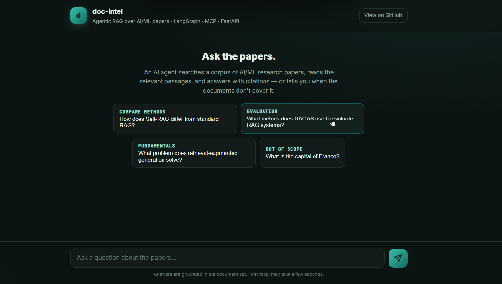

# doc-intel-mcp

An agentic document-intelligence system: ask natural-language questions about a
collection of PDFs and get **grounded, cited answers**. An LLM agent reasons over
the documents using retrieval tools — it searches, reads, and answers only from
what the documents actually say, citing each claim as `[source #chunk]`, and says
so when the documents don't contain the answer.

Built as two front-ends over one set of tools: an **MCP server** (usable from
Claude Desktop or any MCP client) and a **FastAPI service** (`/ask`). Every run is
traced in Langfuse, and answer quality is measured by an LLM-as-judge eval harness.



> A FastAPI chat UI (served at `/`) over the agent. The project is containerized
> with Docker and runs anywhere; the demo above is the local UI.

## Why this exists

LLMs hallucinate about documents they weren't trained on, and a long PDF won't fit
in a prompt. This system solves that with **Retrieval-Augmented Generation (RAG)**:
documents are chunked, embedded, and stored in a vector database; at query time the
most relevant passages are retrieved and the model is instructed to answer *only*
from them.

## Architecture

```
PDFs ─► ingest ─► chunks ─► embeddings ─► vector store (ChromaDB)
                                                  │
                 question ─► LangGraph agent ◄─────┘
                              │   search · read · answer
                              ▼
                  grounded answer with citations
                              │
                              ▼
                      Langfuse trace  +  eval score
```

- **Ingestion** (`ingest.py`): read PDFs → overlapping chunks → embed → store.
- **Retrieval** (`store.py`): local embeddings (`sentence-transformers`) + ChromaDB similarity search.
- **Tools** (`tools/`): `list_documents`, `search_documents`, `read_chunk`, `answer_with_citations`.
- **Agent** (`agent.py`): a LangGraph ReAct agent (Google Gemini) that decides which tools to call, in sequence, until it can answer.
- **Interfaces**: the same tools are exposed as an MCP server (`server.py`) and a FastAPI service (`api.py`).
- **Observability**: every agent run is traced in Langfuse (tool calls, latency, tokens per step).
- **Evaluation** (`eval/`): an LLM-as-judge harness scoring faithfulness, answer relevance, and context relevance.

## Evaluation

`eval/run_eval.py` runs the agent over a question set and has a separate LLM judge
score each answer 1–5 on three RAGAS-style metrics. The set deliberately includes
out-of-scope and hard questions so the harness has to discriminate, not rubber-stamp.

Current results (6-question set):

| Metric            | Avg / 5 |
|-------------------|---------|
| Faithfulness      | 4.2     |
| Answer relevance  | 4.8     |
| Context relevance | 3.5     |

What the numbers show, honestly:
- The harness **correctly flags out-of-scope questions** (e.g. "capital of France" scores context-relevance 1, and the agent refuses to answer from the documents).
- **Faithfulness dips** when the agent supplements retrieved context with parametric knowledge — a real behavior worth catching.
- The judge scores against **the context the agent actually retrieved during its run** — captured per-question via an in-process recorder the retrieval tools write to — not a separate fixed top-k query. An earlier version judged against a fixed top-5, which understated context-relevance because the agent often retrieves more across multiple tool calls.

Perfect scores would be a red flag here; a spread that surfaces real weaknesses is the point.

## Design notes

- **Grounding guard.** The agent answers only from retrieved passages and admits when they don't cover the question.
- **Honest evaluation.** The eval judges against the agent's *real* retrieval path, not a convenient fixed query, so the metrics reflect what actually happened.
- **One source of truth.** Tool logic lives in plain functions; the MCP server, the agent, and the FastAPI app are thin front-ends over them. A framework change (the project survived an `mcp` 1.x→2.x and a LangGraph API break) touches one file.
- **Local, free embeddings.** Retrieval runs offline with no API cost; only the agent's reasoning and the eval judge call a hosted LLM.
- **Lean image.** `torch` is pinned to the CPU wheel index (declared as a direct dependency so the source override applies) — embeddings run on CPU in deployment, so the container skips ~2 GB of CUDA libraries.
- **Rate-limit resilience.** LLM calls retry transient rate-limit errors with backoff.
- **Testing strategy.** Unit tests cover the deterministic retrieval layer and skip cleanly when no index is present (e.g. in CI); answer quality is handled by the eval harness, not flaky unit assertions on LLM output.

## Setup

```bash
uv sync
# add PDFs to data/, then build the index:
uv run python -m doc_intel_mcp.ingest
```

Set the keys the agent, tracing, and eval need:

```bash
export GOOGLE_API_KEY=...          # Gemini (agent + judge)
export LANGFUSE_PUBLIC_KEY=...     # tracing
export LANGFUSE_SECRET_KEY=...
export LANGFUSE_HOST=https://cloud.langfuse.com
# PowerShell: $env:GOOGLE_API_KEY="..."  etc.
```

## Usage

**Command line:**
```bash
uv run python -m doc_intel_mcp.agent "How does Self-RAG differ from standard RAG?"
```

**As a web service:**
```bash
uv run uvicorn doc_intel_mcp.api:app --port 8000
# then open http://127.0.0.1:8000/        (chat UI)
#      or   http://127.0.0.1:8000/docs     (API)
```

**In Docker:**
```bash
docker build -t doc-intel-mcp .
docker run --rm -p 8000:8000 \
  -e GOOGLE_API_KEY=$GOOGLE_API_KEY \
  -e CHROMA_DIR=/data/chroma_db -e DATA_DIR=/data/pdfs \
  -v $(pwd)/chroma_db:/data/chroma_db -v $(pwd)/data:/data/pdfs \
  doc-intel-mcp
```

**As an MCP server** (e.g. in Claude Desktop): point it at this project and set `DATA_DIR`.

## Development

```bash
uv run pytest            # tests (skip without an index)
uv run ruff check .      # lint
uv run python eval/run_eval.py   # evaluation
```

CI (GitHub Actions) runs lint, tests, and a Docker build on every push.

## Tech

Python · MCP · LangGraph · FastAPI · ChromaDB · sentence-transformers · Google Gemini · Langfuse · Docker · GitHub Actions · pytest · ruff

## Roadmap

- Log eval scores back into Langfuse alongside traces
- Multi-stage Docker build to shrink the final image
- Smarter chunking (sentence/section-aware); swap ChromaDB for pgvector/Qdrant
- Agent-as-MCP-client wiring (currently tools are imported directly)

---

Built by Ahmed Aziz Jouili.